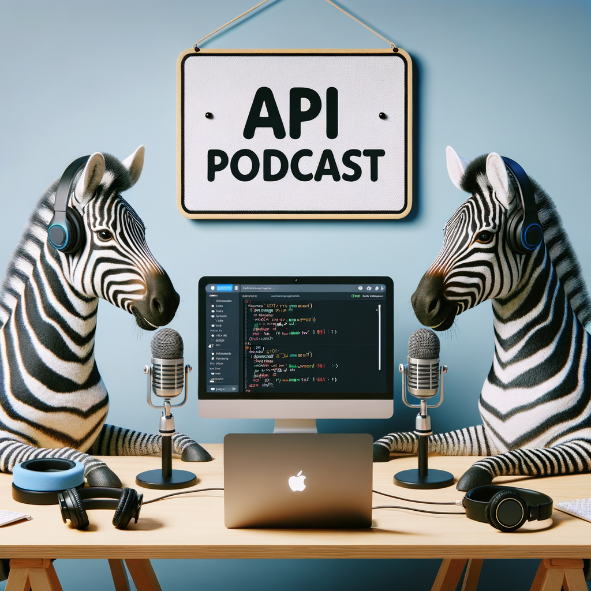

# Welcome to Investec's API Community Swagger Doc 🚀

This repository is your place to have your say on Investec's API Swagger documents. 

We’d love for community members to jump in and help us improve them. If you have updates or suggestions, feel free to contribute! Our API team will review and, if everything checks out, add them to the official documents.

## A podcast overview on all the Swagger docs 🎧

[Download the podcast.](audio/Investec%20API%20Specification%20Podcast.mp4) [5mb | 21 min]

## What's Inside? 📂

This repository includes Swagger documents for:

- **SA PB Account Information**: Access personal and business banking accounts.
- **SA Card Code**: Manage card-related functionalities.
- **SA CIB Account Information**: Corporate and Institutional Banking account details.
- **SA CIB Investec for Intermediaries Foreign Exchange API**: Foreign exchange services for intermediaries.
- **SA CIB Investec for Intermediaries API**: General API for intermediaries.
- **Open API - Authorization / 3-Legged OAuth**: Secure access using OAuth.

## How to Use 🛠️

1. **Explore the Documentation**: Start by looking through the different Swagger files to understand what each API does.
2. **Get Started with API Calls**: Use the documentation to help you make calls to our APIs effectively.

## Stay Updated 🔔

Keep an eye on this repository for the latest updates on our APIs and documentation.

## Contributions Welcome! 🤝

Feel free to contribute by raising issues or submitting pull requests. Your input helps us improve and keep our documentation up-to-date.

## Additional Resources 🌐

- **Official Documentation**: Visit [developer.investec.com](https://developer.investec.com) to see how to use these APIs with your existing Investec accounts.
- **Community Sandbox**: Play around with our APIs in a community sandbox environment [here](https://github.com/Investec-Developer-Community/Community-Projects?tab=readme-ov-file#community-created-sandboxes).

Thank you for choosing Investec's APIs. Together, we build better solutions! 🌟

